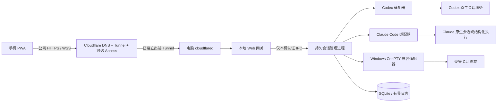

# 手机端 Claude Code / Codex 多会话控制台设计

日期：2026-09-25。状态：规划基线，尚未实现或验证运行链路。

## 1. 目标与范围

手机从外网安全访问本地 Windows 电脑，在统一页面查看多个 Claude Code 和 Codex 会话，查看任务细节，创建会话、发送任务、继续对话、处理授权和中断任务。兼顾电脑上已经运行的会话和控制台新建的会话。

第一版假设单用户、一台 Windows 电脑、手机浏览器/PWA。电脑使用当前用户已安装并登录的 CLI，不上传其凭据。多台电脑、团队账户、应用商店原生 App、推送通知作为后续扩展。电脑必须在线且未休眠；手机关闭页面不应终止电脑上的任务。

用户已确认：外网访问；已有会话与新建会话都需要；查看与输入控制都需要。本方案采用 Cloudflare Tunnel：电脑运行 `cloudflared` 主动连接 Cloudflare，手机浏览器通过用户域名访问；不要求手机安装 Tailscale、不要求 VPS、不要求电脑公网 IP 或路由器端口转发。

## 2. 本机调研证据

- 当前工作目录为空，不是 Git 仓库，没有现成框架。
- Node.js：v24.6.0；Codex CLI：0.154.0；Claude Code：2.1.270。
- Codex 帮助列出 app-server、agents、queue、resume、remote-control；app-server 支持 stdio、协议类型/JSON Schema 导出和 daemon 管理。帮助明确将 app-server 与 remote-control 标为 experimental。
- `codex queue --help` 明确支持给指定 thread 排队发送消息，但本轮没有向任何会话发送消息。
- `claude agents --help` 明确说明 `--json` 可列出活跃交互会话和后台会话；`--all` 还包括已完成后台会话。
- Claude Code 支持后台运行、attach、logs、resume，以及 print 模式的 stream-json 输入输出。
- attach 帮助只承诺打开后台会话，不能由“能列出交互会话”推导“所有交互会话都能 attach”。
- 尚未测试实际会话发现、订阅、附着、授权回传、Windows PTY 或账户适用性。没有读取聊天内容、认证文件或修改 CLI 配置。
- 本轮已成功读取两份官方文档。Codex App Server 文档确认它是面向丰富客户端的深度集成协议，使用双向 JSON-RPC 2.0，支持 stdio、WebSocket 和 Unix socket；WebSocket 远程连接需要 TLS 与配置好的 bearer/capability-token 认证，文档仍明确标注 WebSocket 传输为 experimental/unsupported for production。文档还确认可按当前 CLI 版本生成 TypeScript/JSON Schema，且 WebSocket 入口有有界队列，过载时返回 -32001，客户端应指数退避重试。由此，本项目采用本机 IPC/loopback 优先、Tailscale HTTPS/WSS 作为外层访问，并把协议 schema 生成纳入 Task 1。
- Claude Code Headless 文档确认推荐用 Agent SDK 做程序化集成；CLI 的 `-p/--print` 支持非交互执行、`--output-format stream-json` 结构化流式输出，以及 `--continue`/`--resume` 按会话继续对话。文档说明 `-p` 与 `--bg` 不能组合，并指出停止进程和 SDK `interrupt()` 对未完成轮次的语义不同。因此 Claude 适配器优先采用结构化执行与会话恢复，交互授权或终端能力不足时再降级到受管 PTY。
- 仍尚未测试实际会话发现、订阅、附着、授权回传、Windows PTY 或账户适用性。没有读取聊天内容、认证文件或修改 CLI 配置。

开发时核实资料入口（本轮已成功读取）：https://developers.openai.com/codex/app-server/ 与 https://code.claude.com/docs/en/headless 。Codex 入口当前会重定向到 ChatGPT Learn 的对应文档页；链接仍作为稳定的开发入口保留。

## 3. 方案选择

| 方案 | 优点 | 限制 | 决策 |
| --- | --- | --- | --- |
| 原生会话接口 + 本地 Agent + PWA | 可统一两种工具，保留结构化事件，已有原生会话有接入机会 | 需要逐版本适配和能力检测 | 推荐 |
| 全部使用 PTY + 网页终端 | 新建终端与交互输入直接，贴近电脑操作 | 不能任意接管旧终端，难可靠提取语义进度 | 作为兼容路径 |
| 分别使用两种工具自带远控 | 开发量少，复用厂商能力 | 不是统一多任务面板；可用性依版本及账户而定 | 可作为临时使用方式 |

采取原生接口优先、受管 PTY 兼容的混合方案。接口未通过实测前不承诺完整结构化进度。

## 4. 架构

- 手机端：React + TypeScript + Vite，移动优先 PWA，xterm.js 只用于终端模式。
- Web 网关：Node.js + Fastify，REST 负责查询和操作，WebSocket 负责事件流。
- 会话管理进程：持有适配器、进程与连接，和 Web 网关独立。刷新页面、手机断线、重启 Web 网关都不会主动终止其任务。
- 数据：SQLite 存索引、事件序号、命令去重和操作审计；原始输出按大小轮转。
- PTY：node-pty / Windows ConPTY，安装与 Node 版本兼容性须先验证。
- 不将 Codex app-server、数据库或 PTY 通道直接暴露给手机。

## 5. 已有终端的接入边界

| 会话来源 | 查看方式 | 输入/控制方式 |
| --- | --- | --- |
| 本系统通过原生接口创建 | 原生事件与会话记录 | 适配器发送指令、授权答复和中断 |
| 本系统通过 PTY 创建 | 实时终端与受支持的辅助事件 | PTY 输入及终端快捷键 |
| 已有 Codex 共享服务会话 | 探测可枚举和可订阅的会话 | 经验证后使用原生接口或排队消息；按实际能力开放按钮 |
| 已有 Claude 后台会话 | agents JSON + 日志，验证附着通道 | 仅在 attach 实测支持后开放交互 |
| 已有独立交互终端 | 原生发现；允许范围内的记录/事件补充 | 无原生控制通道时只读，不注入任意窗口 |
| 已结束且可恢复的会话 | 历史记录 | 原进程退出并确认会话无活跃写入后，通过 resume 恢复 |

发现会话与能够读取完整过程、能够控制会话是三件不同的事。每张卡片明确标注“可控制”“仅查看”或“可恢复”。原生发现未覆盖的会话允许按会话 ID 导入，但不得伪装成已接管。

无法无缝接入的旧终端仍属于第一版覆盖范围：提供可用的只读信息和迁移说明；如用户要求所有任意旧终端都必须原地可写，必须先通过技术验证再承诺，不能以重启冒充无缝接管。

同一会话默认一个网页写入控制者。对外部电脑终端的写入无法强制上锁时，界面明确提示存在外部控制者；只读优先，启用手机写入需显式取得控制。禁止后台自动 resume 活跃会话，以免重复执行。

## 6. 手机操作流程

### 首页

按运行中、等待输入/授权、空闲、失败、已结束筛选。任务卡片展示工具、名称、项目、当前步骤、最后活动时间和连接状态。可以同时查看多个任务，切换详情不影响其他任务。

### 新建任务

选择 Claude Code / Codex → 选择电脑上预先登记的项目 → 可选模型和已允许的权限配置 → 输入任务内容 → 创建。

手机选择的是电脑目录。服务端验证真实路径处于允许目录内，包括 Windows junction/symlink 解析。同一项目同时运行修改任务时默认使用独立 Git worktree；非 Git 项目或拒绝隔离时，同一目录只允许一个写入任务，其余排队。

### 任务详情

- 概览：状态、耗时、当前活动、已执行步骤、实际可用的用量数据。
- 活动时间线：用户指令、助手公开回复、工具调用、命令输出、错误和文件变更。
- 终端：在有终端流的会话显示，提供 Enter、Esc、Ctrl+C 等手机快捷键。
- 输入框：发送后显示“已接收”“已排队”“开始执行”或“发送失败”；这些状态按实际来源区分。
- 操作：发送新指令、中断当前轮、结束受管会话、恢复已结束会话。中断不等同于可恢复暂停，第一版不承诺任意暂停/继续进程。
- 权限请求：展示请求原因、命令或目标路径、批准/拒绝；只有适配器实际支持回答时才提供结构化按钮，否则保留终端交互。

无公开事件时不展示模型内部思维。没有明确任务清单时不展示总进度百分比；有清单则展示已完成项数，并说明清单可能变化。费用仅在来源明确时展示，否则显示不可用。

## 7. 状态与数据合同

会话状态与一次任务轮次分开：

- 会话生命周期：active / ended / unavailable。
- 轮次状态：queued / running / waiting_input / waiting_approval / completed / failed / cancelled / unknown。
- 连接状态：online / reconnecting / offline。

CLI 仍在运行但一轮已结束时应显示“空闲，可继续输入”；不能将进程存在直接等同于任务运行。外部记录没有权威状态时使用 unknown。手机断线不改变任务执行状态。

会话索引包括 appSessionId、provider、providerSessionId、projectId、source、capabilities、lastSeenAt。能力至少覆盖 readHistory、streamEvents、terminal、send、queue、interrupt、approve、resume。不同适配器返回不同能力，前端不猜测。

统一事件包括 sessionId、seq、occurredAt、receivedAt、type、source、payload；数据库按 sessionId + seq 去重。seq 由本地管理进程为已接收事件分配，只保证本地重放顺序，不声称补齐上游从未发送的事件。

写入命令使用 commandId 去重。写入前落盘意图，执行后记录结果。断线重试相同 commandId 不重复提交；若进程在外部写入后、落盘确认前崩溃，标注“结果待确认”，先查询上游，无法确认时不自动重发。PTY 输入不能宣称严格 exactly-once。

## 8. 外网与操作权限

默认使用 Cloudflare Tunnel 和用户自己的 HTTPS 域名。电脑上的 `cloudflared` 主动建立出站加密连接，网关只监听 `127.0.0.1`；Cloudflare 负责 DNS、TLS 和 Tunnel 转发，可选 Cloudflare Access 作为外层身份认证。手机只需浏览器，不需要安装 Tailscale。不要把本地网关端口直接暴露到公网。

首次配对在电脑本机产生短时一次性代码，手机兑换设备会话；使用 Secure、HttpOnly、SameSite cookie，代码限速、单次使用、五分钟过期。支持电脑撤销手机设备。HTTP 与 WebSocket 都检查认证；写操作检查 CSRF/Origin，WebSocket 检查 Origin，过期或撤销会话断开控制连接。

CLI 凭据只由本机 CLI 使用，不返回到手机；不采集登录命令输入。日志可能含项目内容，按项目允许范围读取并做常见密钥脱敏，不能声称脱敏能识别全部秘密。

用户输入通过协议字段或 stdin 传递，不拼接为 shell 命令。provider、CLI 路径、参数模板由服务端控制；验证中文、空格、引号和换行。停止任务仅针对明确归属本工具的进程树，外部会话使用其原生中断协议；PID 不明时禁止批量杀进程。

保留 CLI 的正常审批和沙箱配置，不为远控默认开启绕过权限选项。部署时配置 Windows 当前用户登录启动；不以 SYSTEM 身份运行依赖个人 CLI 凭据的 Agent。

## 9. 重连、容量与恢复

- 初始并发上限为 5 个执行会话，可配置；额外任务排队。真实上限取决于电脑、提供商限流与账户，监控面板不会突破这些限制。
- 事件分页与虚拟列表；单连接发送队列不超过 1 MiB，超出后断开并按游标重连。
- 重连携带每会话最后 seq；超出保留范围返回 gap + 最新快照，显示缺失区间，禁止静默伪造连续日志。
- 默认每会话保留最多 20 MiB 原始日志，总配额 1 GiB、最长 7 天，先到者生效；保护当前活跃日志段，不清理提供商自己的历史记录。
- PWA 只缓存静态外壳，不缓存认证接口、任务日志和输入草稿。离线时禁用发送，防止恢复网络后执行过时任务。
- 会话管理进程故障后，原生持久会话重新发现；PTY 任务能否幸存取决于宿主，状态先置 unknown/unavailable 后核实。不承诺管理进程崩溃后 PTY 无损恢复，也不自动重跑指令。
- 电脑离线/休眠时显示最后活动时间。唤醒后重连；第一版不提供远程唤醒。

## 10. 验收标准

1. 手机关闭 Wi-Fi 使用蜂窝网络，经私网 HTTPS 登录并查看任务；未配对设备不能读取任务或发送输入。
2. 分别新建一个 Codex 和一个 Claude 任务，指定正确项目目录，看到输出并能追加一轮指令。
3. 同时监控 5 个模拟活动会话，并验证至少两个真实 CLI 会话并行，日志和输入无串线。
4. 在对应版本支持的前提下，发现一个已有 Codex 会话和一个已有 Claude 会话；对可控制会话成功交互，对不可控制会话明确显示只读及恢复路径。
5. 测试等待授权、拒绝、任务失败、中断、结束以及空闲后继续输入，状态与真实行为一致。
6. 手机断网 30 秒后重连、刷新页面、重启 Web 网关，任务继续运行；已接收命令不因重连重复执行。
7. 同目录并发写入被隔离或排队；路径越界、未授权 WebSocket、跨来源写入、重复 commandId 被正确处理。
8. 管理进程故障与日志轮转后能显示真实恢复状态/缺口，不误报任务成功或自动重跑。
9. iOS Safari 与 Android Chrome 的窄屏、中文输入法、软键盘弹起、滚动和终端快捷键可用。

## 11. 本轮不执行的操作

本轮仅写规划文档。未安装依赖、初始化 Git、配置外网、启动远控、修改现有任务、读取真实聊天记录或发送 CLI 任务。下一阶段先完成隔离测试会话的接入验证，再按结果实现。
